
> 茑屋书店的增长密码 ---李云龙

#### 知识回顾

---

1、思维模型的应用方法

2、案例本身可以提供给我们的思辨角度

破界创新三部曲

1、`破`隐含假设

2、`立`基石假设

3、`见`全新系统

#### 案例分析

---

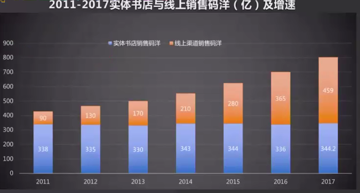

- 2018年国内实体书店经营规模比2017年萎缩6.69%,实体书店销量7、8年基本处于负增长
- 2011年美国最大连锁书店之一的Borders宣布破产
- 日本每年约有300余家书店面临倒闭风险

##### 茑屋书店的崛起

大概7000万的会员，日本人口1.268亿。

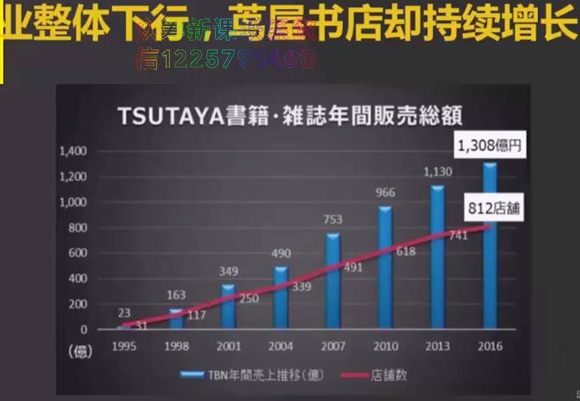

“很多书店活不下去，就是因为他们在`卖书`” ---增田宗昭

茑屋书店看起来像个咖啡厅。

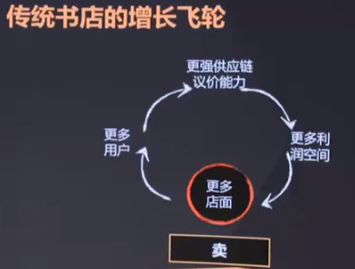

茑屋书店不卖书吗？卖

专业的人为您服务！

书只是生活方式的入口。

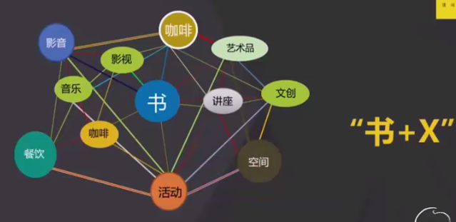

“书+X”就是茑屋书店的增长密码吗？

CCC文化便利俱乐部

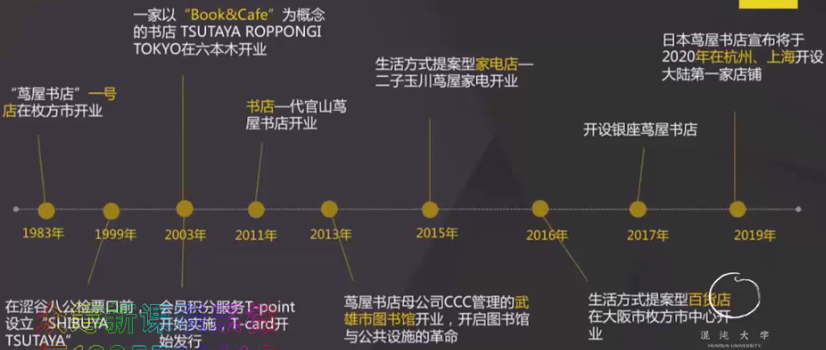

设计公司--TSUTAYA--娱乐公司--市场营销公司--T-MEDIA HOLDINGS

#### 茑屋书店的盈利分布：

20%来自图书音像制品的 小猴

80%来自于特许经营业务

日本人特别喜欢做积分！7000万的用户在用T-card，可以用T-card去消费！

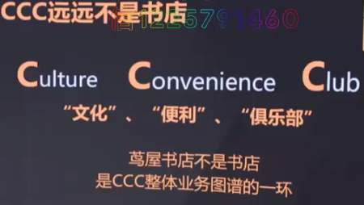

CCC的诸多业务之间，有什么共通性吗？

将时间浪费在美好的事物上。

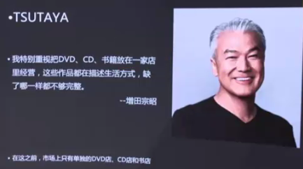

茑屋家电不是提供10000中商品，而是提供100中`生活`。

都朝着同一个方向努力，不经意就会产生协同效应。

'效率不带来幸福，要做让人感到幸福的事情'

'向生活提案'

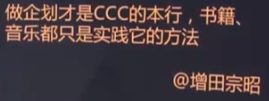

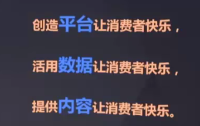

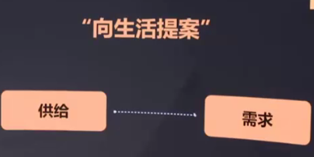

- 旧商业系统（增长飞轮)   卖

  茑屋书店是买场，而非卖场

  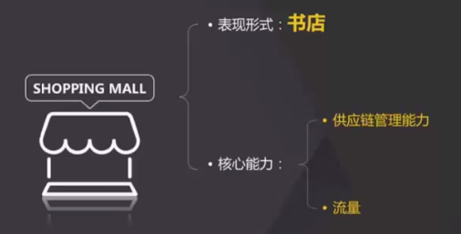

`流量思维` 流量X转化率

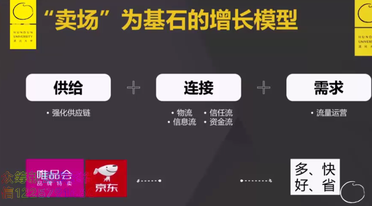

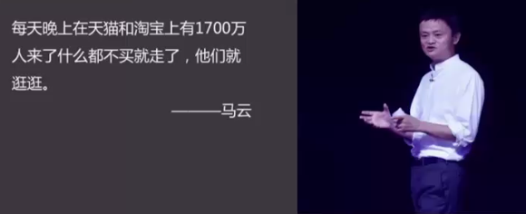

免费开放玩的时间，让用户更多的逗留在此！免费的游戏，要你买装备！

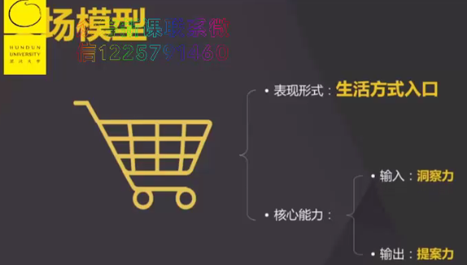

提案力：策划力和设计力

超级用户思维：LTV/CAC

让用户留的越久越好！

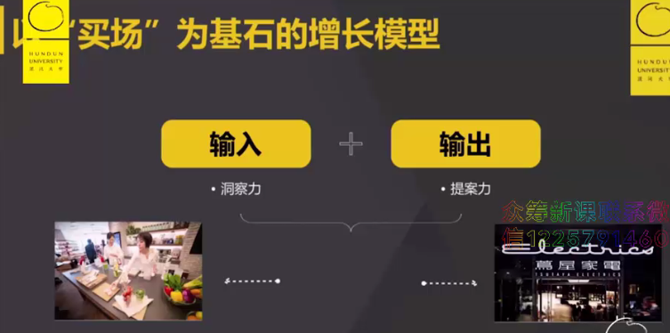

以人为主！

不是提供10000种商品，而是提供100种生活！

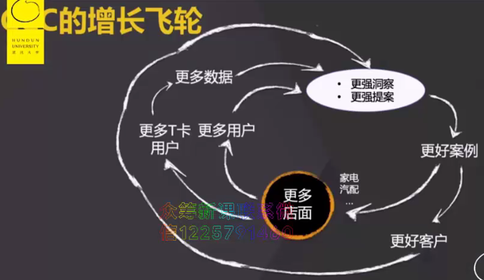

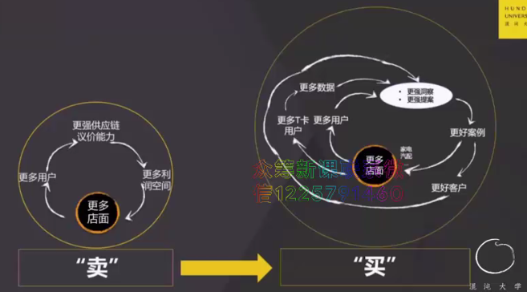

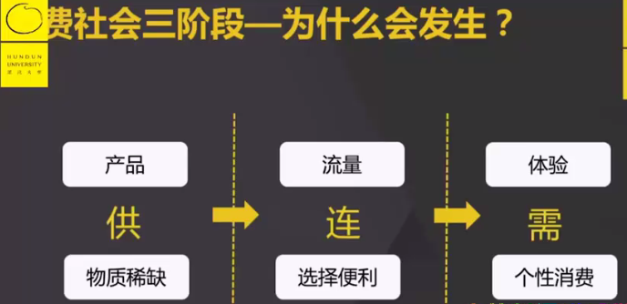

不管在哪个阶段，核心就是‘稀缺’！

增田修炼，直觉力：跑步观察法！

利他心：用脑子想自己的事，用心想别人的事！

 #### 新知共享

---

茑屋书店来到中国！

可以成为网红点，但构建网络效应很难。 

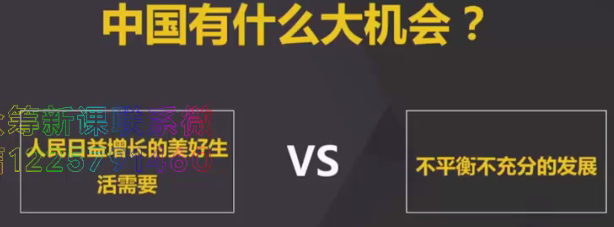

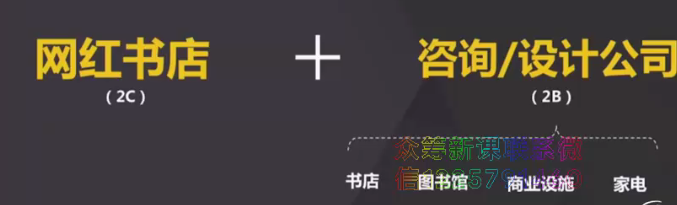

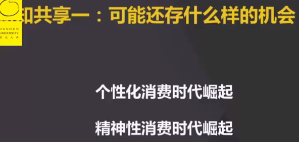

大地总有短长，天空总有无限！

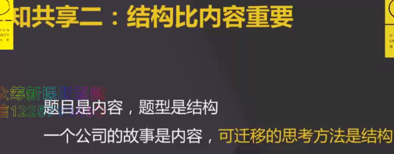

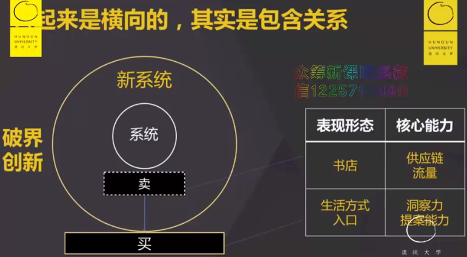

#### 草莓时刻

---

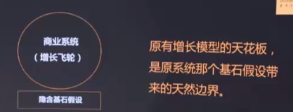

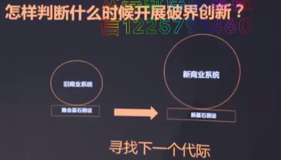

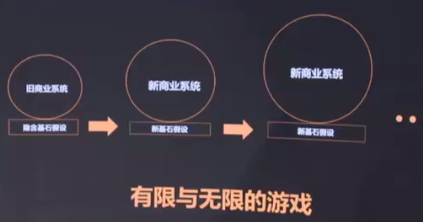

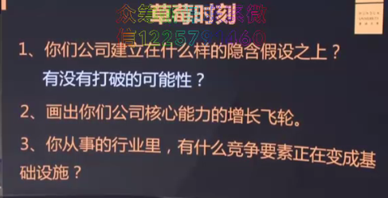

