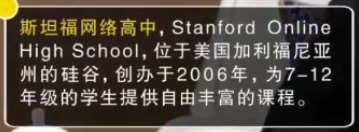
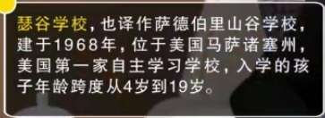
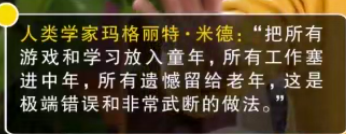
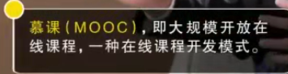
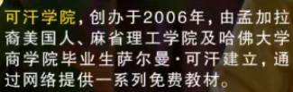

# 未来学校_朱永新-重新定义教育

> 今天的学校会被未来的学习中心取代

一、现代学校是为了适应`工业化生产`的需要而产生的。

- 同样的年龄，同样的内容，但有些人会了。学生只有一个学习空间

二、未来学习中心

- 国家制定标准（基本素养）
- 社会各种教育培训机构
- 允许和鼓励开办学习中心
- 爷爷奶奶和孙子学习一样的东西

成功的案例：

没有教师，没有教师，没有操场。两天上远程课堂。

更小的孩子：

> 会不会三天打鱼，两天晒网。--孩子天生具有好奇心，自我探索的能力！

不喜欢的东西才是负担。喜欢的东西自己会去搜索！

自己建构起来的知识，才是真的自己的知识。

留出足够的空间，让孩子自己去建构。

第一：没有影响上大学

第二：在大学的表现很好（自律,更好的管理自己）

第三：做公益，做艺术，做创造性的，企业家很多（创新，创业）

人其实是一个正态分布，自己会成长起来。

爱因斯坦和牛顿，大部分都是自己学习的。

面向高中的学生：

新教育学校

学校应该是汇聚美好事物的地方。让学生和他相遇。

压缩学制，高中最后一年是不教学的。都在压缩

博士生毕业30多岁，人生那么短，终身学习！20岁左右就应该走向社会，去创造

一个人一生换工作15次。更多的是素养，美国世界500强主要就是看能力看领导力看创新力。

按照学习中心概念，未来没有高考！

未来是一个课程为王的时代！

不允许提交学校证明。不看背景只看能力，只有多做事，多证明自己的能力。

未来大学不是人才，不存在高考。

改革的进程中，总会存在探索期的。未来所有的人都在学习。

没有身份标签，有学习经历的证明，`学分银行`。

没有200-300万在家学习的！

变成无处不在的同学！同一个年龄，同一个层次，一起学习。这样的认知本生就是存在问题的。同学之间的影响，超过老师的影响。

> 家长的水平，会不会影响孩子的发展方向。

国际教育资源平台，国家课程中心，发现和选择最好的教育资源。

最好的资源，网络资源，但是网络资源还不能获得真正的面对面。

